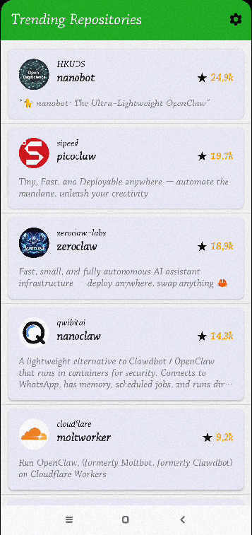
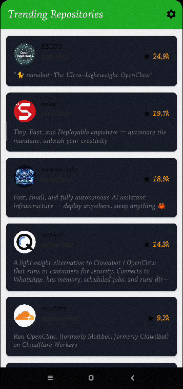
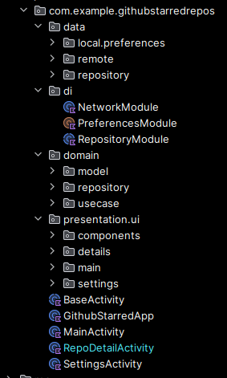

GitHub Trending Repos 

Une application Android moderne qui affiche les dépôts GitHub les plus étoilés créés au cours des 30 derniers jours. Ce projet est construit avec une architecture Clean Architecture + MVVM, en utilisant les dernières technologies Android (Kotlin, Coroutines, Flow, Hilt).

#Captures d'écran

    
    
    
    

✨ Fonctionnalités

    Liste Trending : Affiche les dépôts les plus populaires créés récemment via l'API GitHub.
    Pagination Infinie : Utilisation de Paging 3 pour un défilement fluide et optimisé.
    Détails du dépôt : Cliquez sur un élément pour voir les détails (description, stars, langue).
    Navigation Web : Bouton pour ouvrir le dépôt directement dans le navigateur.
    Gestion du thème : Support du mode Clair / Sombre.

 Architecture

L'application est construite selon les principes de la Clean Architecture pour séparer les responsabilités et faciliter les tests.
Couches

    Presentation : Couche UI (Activities, ViewModels, Adapters). Gère l'affichage et les interactions utilisateur via StateFlow.
    Domain : Couche métier (UseCases, Modèles, Interfaces Repository). Contient la logique pure de l'application.
    Data : Couche de données (Repository Implementation, API Retrofit, DTOs, Mappers). Gère la source de vérité.

Flux de données (Unidirectionnel - UDVF)

User Action -> ViewModel -> UseCase -> Repository -> API -> Flow -> StateFlow -> UI Update
### Stack Technique
Technologie	Description
Kotlin	Langage principal (100% Kotlin).
Coroutines & Flow	Gestion de l'asynchronisme et des flux de données réactifs.
Paging 3	Librairie Jetpack pour la pagination efficace et la mise en cache.
Hilt	Injection de dépendances (Standard Google recommandé).
Retrofit & OkHttp	Client HTTP et intercepteur réseau.
Gson	Conversion JSON.
ViewBinding	Liaison type-safe entre le code et les vues XML.
Material Design 3	Composants UI modernes.
Glide	Chargement d'images optimisé.
 Structure du Projet

    

 Installation

    Clonez le dépôt :
    bash
     
      
     
    git clone https://github.com/VOTRE_USERNAME/GithubTrendingReposMVVM.git
     
     
      
    Ouvrez le projet avec Android Studio. 
    Laissez Gradle synchroniser les dépendances. 
    Lancez l'application sur un émulateur (API 24+) ou un appareil réel. 

🔧 Concepts Clés Implémentés

     StateFlow : Pour exposer l'état de l'UI de manière réactive et observable par la vue (Activity/Fragment).
     Sealed Classes : Pour représenter l'état de l'UI (Loading, Success, Error) de manière exhaustive et sûre.
     Dependency Injection : Toutes les dépendances sont fournies par Hilt (@HiltViewModel, @Inject, @Module).
     Extension Functions : Pour simplifier le mapping des données (fun RepositoryDto.toDomain()).
     